# Summarazorator - Forum of Razor Sharp Summaries!

**Deployed website: [Link to website](https://summarazorator-f7c027b4c8d6.herokuapp.com/)**

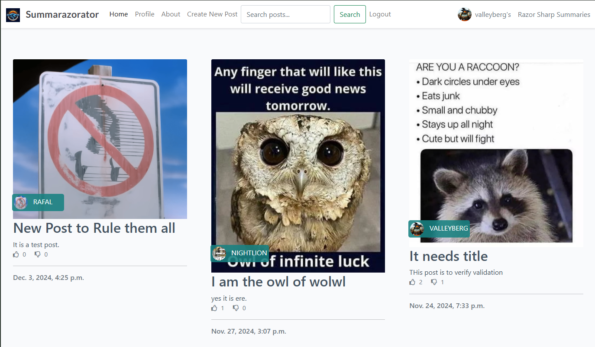

## About

Summarazorator is a community-driven platform for content summarization and collaboration. It provides a space where users can share and discuss ideas, collaborate on content summarization, and engage with a vibrant community of like-minded individuals.

The platform features a user-friendly interface that allows members to:
- Share and discuss content through posts
- Collaborate through positive and negative comments
- Engage with the community through an intuitive forum system
- Manage personal profiles and preferences
- Submit collaboration requests and feedback

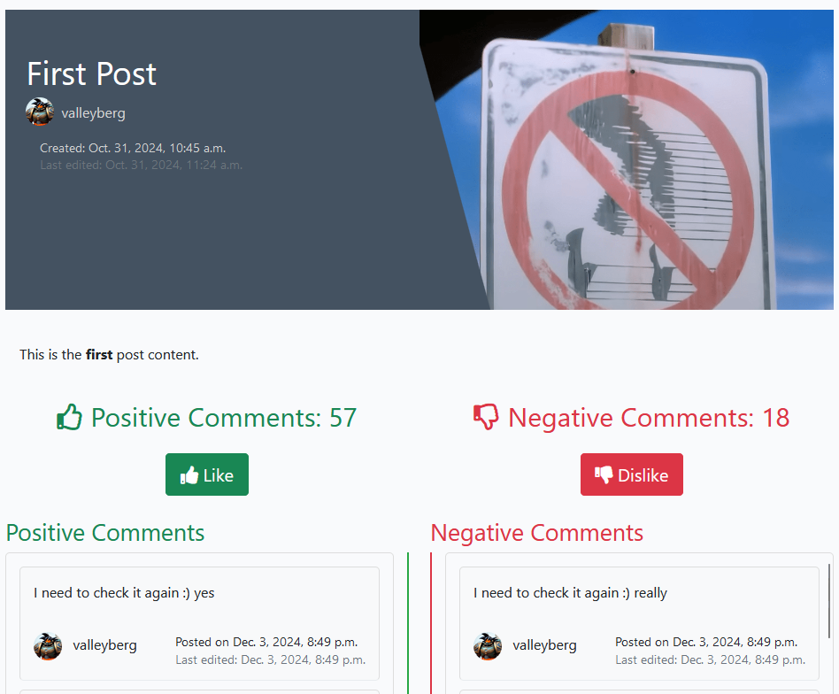

---

## UX

The website was designed with a minimalist approach, focusing on readability and ease of use. The emphasis is on content and community interaction, with a clean interface that helps users focus on what matters most - the content, their discussions and voting using Like or Dislike content buttons.

### Target Audience

The platform is designed for:
- Content creators and writers
- Readers seeking concise summaries
- Community members interested in sharing and discussing ideas
- Professionals and students who value efficient information processing
- Users seeking help or wanting to expand their knowledge on various topics

### User Stories

| Issue ID    | User Story |
|-------------|-------------|
| [#1](https://github.com/cptvalleyberg84/summarazorator/issues/1) | As a Site User, I can register an account so that I can create posts and comment. |
| [#2](https://github.com/cptvalleyberg84/summarazorator/issues/2) | As a Logged-in User, I can create a new post so that I can share content with the community. |
| [#3](https://github.com/cptvalleyberg84/summarazorator/issues/3) | As a Site User, I can click on a post to view its full content. |
| [#4](https://github.com/cptvalleyberg84/summarazorator/issues/4) | As a Post Owner, I can edit my post so that I can correct or update the content. |
| [#5](https://github.com/cptvalleyberg84/summarazorator/issues/5) | As a Post Owner, I can delete my post so that it no longer appears on the site. |
| [#6](https://github.com/cptvalleyberg84/summarazorator/issues/6) | As a Site User, I can view comments on a post so that I can follow the conversation. |
| [#7](https://github.com/cptvalleyberg84/summarazorator/issues/7) | As a Logged-in User, I can add a comment (positive or negative) on a post so that I can participate in the conversation. |
| [#8](https://github.com/cptvalleyberg84/summarazorator/issues/8) | As a Comment Owner, I can edit my comment so that I can correct or change what I wrote. |
| [#9](https://github.com/cptvalleyberg84/summarazorator/issues/9) | As the Comment Owner I want to delete m comment so that it is no longer visible under the post. |
| [#10](https://github.com/cptvalleyberg84/summarazorator/issues/10) | As a User I want to like or dislike the content so it is clear what type of opinion I am sharing. |
| [#11](https://github.com/cptvalleyberg84/summarazorator/issues/11) | As a User I want to read more info about the app so it is easy for me to understand who made it and what the Summarazorator is about. |
| [#12](https://github.com/cptvalleyberg84/summarazorator/issues/12) | As a User I want to easily be able to edit and remove my content, so I can correct the text or get rid of it whenever I need.  |
| [#13](https://github.com/cptvalleyberg84/summarazorator/issues/13) | As a User I want to have a place for my user to write my bio and change my profile image, so I feel more like myself in the app. |
| [#14](https://github.com/cptvalleyberg84/summarazorator/issues/14) | As a User I want to view profile of authors that I like, so I can find more of their content. |
| [#15](https://github.com/cptvalleyberg84/summarazorator/issues/15) | As an Admin, I want user to have easy collaboration form, so that I can receive their messages into my admin account. |
| [#16](https://github.com/cptvalleyberg84/summarazorator/issues/16) | As a Reader I want to see all posts from a specific author so that I can explore more content from authors I enjoy *(Future feature)*|
| [#17](https://github.com/cptvalleyberg84/summarazorator/issues/17) | As a User I want to be able to search through the posts and view results, so I can easily find related content |

*All User stories were initially created in Microsoft TO DO*

**Link to the Board**
[Link to Summarazorator Board on Github Projects](https://github.com/users/cptvalleyberg84/projects/3/views/2)

**Link to Milestones / EPICS**
There are 3 views available to check out at the link. The Project Board, The Project Table and the Project Roadmap. Github Milestones where used to collect User Stories and forming the Project EPICs.

[Link to Summarazorator Project Milestones](https://github.com/cptvalleyberg84/summarazorator/milestones)

Details in [Agile Methodology](#agile-methodology)

## Future Development

#### Third-party Websites

Facebook, Twitter, Youtube, and Instagram integration were not considered for this development phase, but placeholder links to these social media platforms are present in the website footer.

#### More Details about the App future:

Considered, but out of scope has become:

- User-specific page views displaying all content from one author
- Random topic suggestions (3 random topics above footer)
- Recent activity display in the navbar (last 3 activities)
- TO-Do list functionality for bookmarking posts to read or comment on
- Topic-based categorization (e.g., movie reviews, technology)
- Google authorization integration

---

## Technologies used
- ### Languages:

    + [Python 3.12.2](https://www.python.org/downloads/release/python-3122/): the primary language used to develop the server-side of the website.
    + [JavaScript](https://www.javascript.com/): Frontend interactivity
    + [HTML5](https://developer.mozilla.org/en-US/docs/Web/HTML): Website structure
    + [CSS3](https://developer.mozilla.org/en-US/docs/Web/css): Website styling

- ### Frameworks and libraries:

    + [Django](https://www.djangoproject.com/): Main web framework
    + [Bootstrap 5](https://getbootstrap.com/): Frontend framework
    + [jQuery](https://jquery.com/): JavaScript library for DOM manipulation
    + [Django Summernote](https://github.com/summernote/django-summernote): Rich text editor
    + [Django Allauth](https://django-allauth.readthedocs.io/): Authentication
    + [Crispy Forms](https://django-crispy-forms.readthedocs.io/): Form rendering
    + [Cloudinary](https://cloudinary.com/): Media file management

- ### Databases:

    + [SQLite3](https://www.sqlite.org/): Development database
    + [PostgreSQL](https://www.postgresql.org/): Production database

- ### Primary Tools:

    + [Gitpod](https://www.gitpod.io/): the version control system used to manage the code.
    + [GitHub](https://github.com/): Code repository
    + [Chrome DevTools](https://developer.chrome.com/docs/devtools/open/): Development and debugging
    + [WhiteNoise](https://whitenoise.readthedocs.io/en/stable/index.html): Static file serving

- ### Deployment and Services:
    + [Gunicorn](https://gunicorn.org/): Python WSGI HTTP Server
    + [Heroku](https://www.heroku.com/): Application hosting
    + [Cloudinary](https://cloudinary.com/): Media file hosting

- ### Design Tools:
    + [Font Awesome](https://fontawesome.com/): Icons
    + [Google Fonts](https://fonts.google.com/): Typography
    + [Balsamiq WireFrames](https://balsamiq.com/): App Wireframes
    + [Miro Board](https://miro.com/): Diagrams

- ### Other Tools:
    + [W3C Validator](https://validator.w3.org/): was used to validate HTML5 code for the website.
    + [W3C CSS validator](https://jigsaw.w3.org/css-validator/): was used to validate CSS code for the website.
    + [JShint](https://jshint.com/): was used to validate JS code for the website.
    + [PEP8](https://pep8ci.herokuapp.com/#): was used to validate Python code for the website.

---

## Features

### Access to Pages According to User Role
| Page Name | Not Logged In | Logged In User |
|-----------|---------------|----------------|
| Home | Yes | Yes |
| Login | Yes | No |
| Register | Yes | No |
| Logout | No | Yes |
| View Posts | Yes | Yes |
| Create Post | No | Yes |
| Edit Post | No | Yes (own posts) |
| Delete Post | No | Yes (own posts) |
| Add Comments | No | Yes |
| Edit Comments | No | Yes (own comments) |
| Delete Comments | No | Yes (own comments) |
| View Profiles | Yes | Yes |
| Edit Profile | No | Yes (own profile) |

### Main Features

#### Navigation Bar

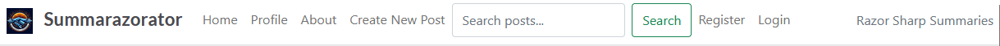

The navigation bar is present on all pages and includes:
- Logo that redirects to the home page
- Home button to return to the main page
- Profile page (for logged-in users) containing:
  - View Profile
  - Edit Profile
  - Delete Profile option under Edit Profile view
- Profile page (for non-logged-in users) containing redirection to Login/Register page
- About page
- Create Post button (for logged-in users)
- Create Post button (for non-logged-in users) containing redirection to Login/Register page
- Search bar to find posts by title or content
- Logout (for logged-in users)
- Login/Register buttons (for non-logged-in users)

#### Footer
Contains:
- Site "Made by" information
- Social media links "Follow us"

#### Home Page
- Displays paginated list of posts (6 per page)
- Each post shows:
  - Title
  - Author information with profile link
  - Creation date
  - Excerpt
  - Featured image (if any exists else placeholder image)
  - Number of positive and negative comments

  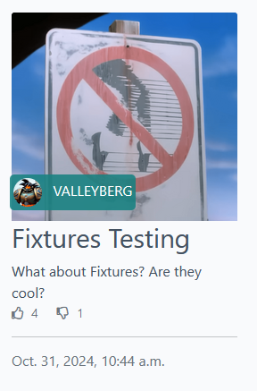

#### Post Detail Page

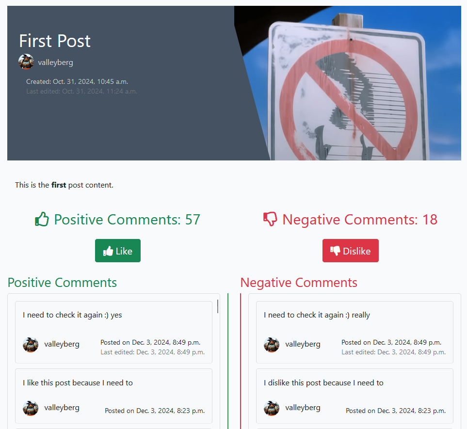

- Full post content
- Featured image
- Author information with profile link
- Creation and last update timestamps
- Number of positive and negative comments
- Separate sections for positive and negative comments
- Comment submission form after clicking Like or Dislike button (for logged-in users)
- Post Edit and delete options (for post author)
- Comment Edit and delete options (for comment author)

#### Profile Page

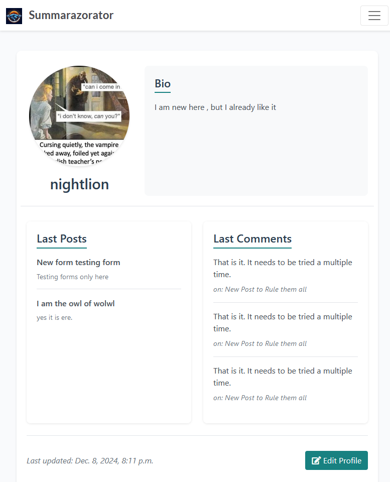

Features:
- Profile picture (if any, if not the placeholder image)
- Username
- Bio
- Recent activity section showing:
  - Recent posts
  - Recent comments
- Edit profile button (for profile owner) displaying edit profile page including:
  - Profile image upload/change option
  - Bio text Edit / write
  - Delete User button (clicking shows another Warnning message and demands confirmation to delete User account and all posts and all comments)

#### Post Management
Create Post:
- Title field
- Content editor
- Featured image upload
- Post excerpt
- Draft/Publish status selection

Edit Post:
- Modify all post fields
- Update featured image
- Change post status
- Automatic update timestamp

#### Comment System
Two types of comments:
- Positive comments section
- Negative comments section

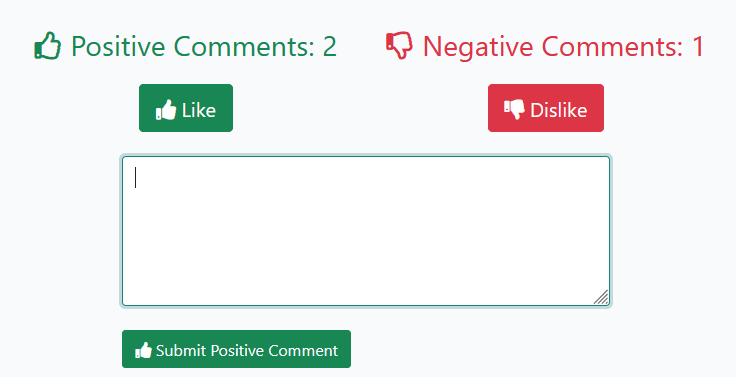

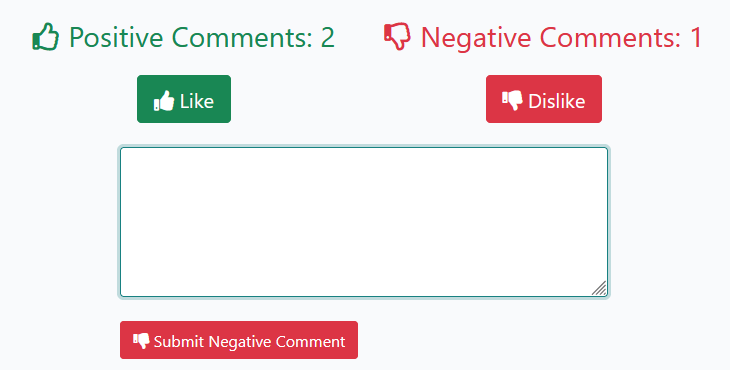

Comment features:
- Add new comments
- Edit own comments
- Delete own comments
- View comment author profiles
- Timestamps for creation and updates

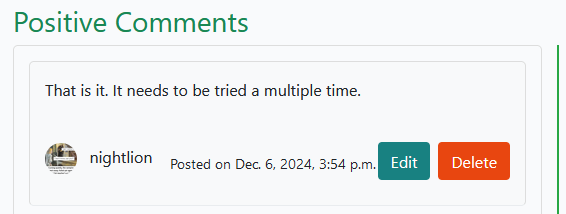

#### Search Functionality

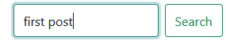

- Search posts by title
- Search posts by content
- Results displayed with post previews

#### Security Features
- Protected routes requiring authentication
- CSRF protection on all forms
- User-specific content management
- Secure image handling through Cloudinary

---
## Design

### Color Scheme

The website uses a carefully selected color palette that creates a professional and engaging user experience:

- Primary Colors:
  - Teal (#188181) - Used for interactive elements and highlights
  - White (#FFFFFF) - Used for content backgrounds
  - Light Gray (#F9FAFC) - Used for main background
  - Red (#E84610) - Used for accents and important elements
  - Dark Blue (#445261) - Used for Footer and dark backgrounds

- UI Elements:
  - Text Color (#4A4A4F) - Main text color for optimal readability
  - Card Background - Transparent with white base
  - Flash Messages Background (#188181e1) - Semi-transparent teal
  - Link Colors - Teal for normal state, darker shade for hover

### Typography

The website uses a clean and modern typography system:

- Primary Font: Lato (sans-serif)
  - Used for brand name and headings
  - Weights used:
    - Light (300) for subtle text
    - Regular (400) for body text
    - Bold (700) for emphasis and headings

- Text Hierarchy:
  - Brand Text: 1.4rem
  - Headings: Various sizes for clear hierarchy
  - Body Text: Default size for readability
  - Author Names: Uppercase for distinction (on index page)

### Design Elements

- Cards
  - Clean, borderless design
  - Transparent background
  - Consistent spacing (20px bottom margin)

- Images
  - Responsive scaling
  - Featured images with overlay text
  - Logo variations:
    - Header Logo: 32x32px
    - About Page Logo: 75% width

- Interactive Elements
  - Buttons with hover effects
  - Form inputs with clear focus states
  - Comment sections with scrollable content
  - Flash messages for user feedback

- Layout
  - Responsive grid system
  - Flexible masthead design (33vh height)
  - Clean comment threading
  - Proper spacing between elements
  - Full-width featured images

### Responsive Design
- Adapts to different screen sizes
- Mobile-first approach
- Flexible image containers
- Responsive typography
- Collapsible navigation

This design system ensures a consistent, professional, and user-friendly experience across the platform while maintaining high standards of accessibility and readability.

### Imagery

- The main logo image and few of post featuring images were generated with the use of the [Bing Image Creator](https://www.bing.com/images/create) tool.

- Images were made by users who tested the app

- Used some icons from the [font awesome](https://fontawesome.com/) website. Icons are essential for the user experience when it comes to multifunctional websites.

### Wireframes

  [Summarazorator Wireframes](documentation/design/summarazorator_wireframes.pdf)

---

## Agile Methodology

### GitHub Project Management

GitHub Project Management was used to manage the project.

[Summarazorator Project Board](https://github.com/users/cptvalleyberg84/projects/3/views/3)

The Project Board:

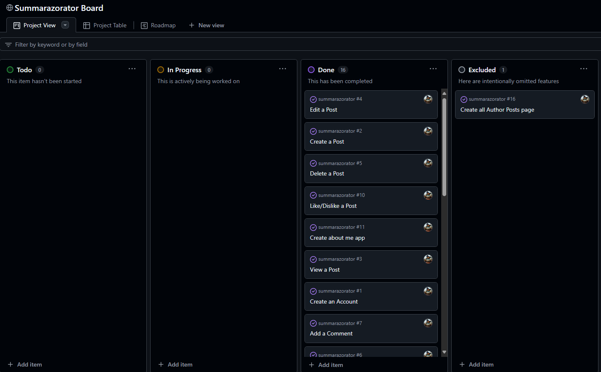

The Project Roadmap:

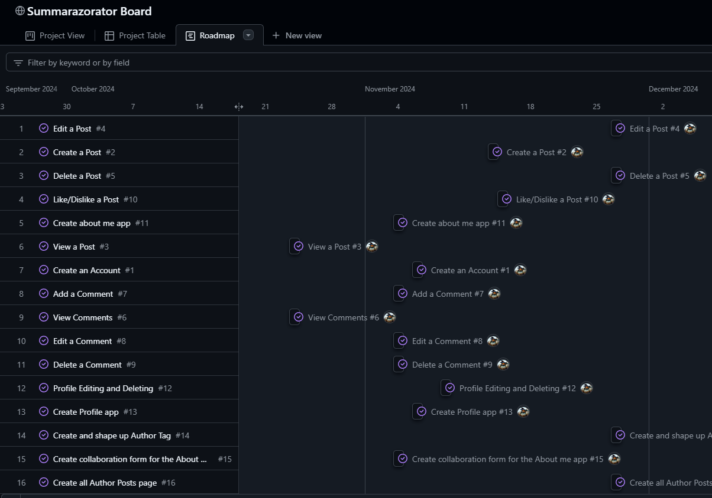

Some User Stories were also collected into EPICS using the GitHub Milestones:

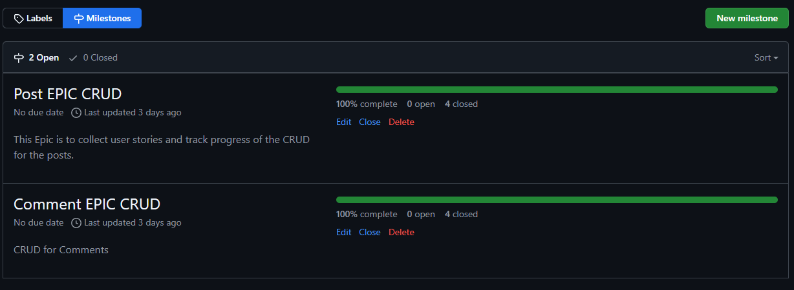

### Other Software

To track ideas and bugs during development, Microsoft TO DO was utilized as a lightweight task management tool.
Its quick and easy interface proved valuable, though it was adapted to fit the project's in-house methods, styling, and documentation needs.

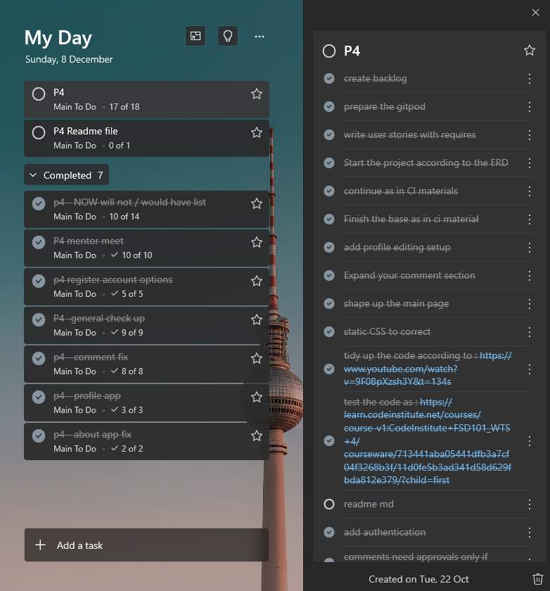

---

## Flowcharts

To understand how to begin I created a flowchart ERD using MIRO Board.

[Flowchart](documentation/images/flowchart.png)

---

## Information Architecture

### Database
- The application was initially developed using SQLite for development
- For production, the database was migrated to PostgreSQL
- Uses Django's ORM for database operations
- Implements proper foreign key relationships and cascading deletes

### Data Modeling

#### Post Model
| Name | Database Key | Field Type | Validation |
|------|--------------|------------|------------|
| Title | post_title | CharField | max_length=200, unique=True, not empty |
| Slug | post_slug | SlugField | max_length=200, unique=True |
| Author | post_author | ForeignKey(User) | on_delete=CASCADE |
| Featured Image | post_featured_image | CloudinaryField | default='placeholder' |
| Content | post_content | TextField | Required |
| Excerpt | post_excerpt | TextField | Optional |
| Created Date | post_created_on | DateTimeField | auto_now_add=True |
| Updated Date | post_updated_at | DateTimeField | auto_now=True |
| Status | post_status | IntegerField | choices=[0:Draft, 1:Published] |

#### Comment Model
| Name | Database Key | Field Type | Validation |
|------|--------------|------------|------------|
| Parent Post | parent_post | ForeignKey(Post) | on_delete=CASCADE |
| Author | comment_author | ForeignKey(User) | on_delete=CASCADE |
| Content | comment_body | TextField | Required |
| Type | comment_type | CharField | max_length=10, choices=[positive, negative] |
| Created Date | comment_created_on | DateTimeField | auto_now_add=True |
| Updated Date | comment_updated_at | DateTimeField | auto_now=True |
| Approved | comment_approved | BooleanField | default=False |

#### Profile Model
| Name | Database Key | Field Type | Validation |
|------|--------------|------------|------------|
| User | profile_user | OneToOneField(User) | on_delete=CASCADE |
| Profile Image | profile_image | CloudinaryField | default='static/images/default.png' |
| Bio | profile_bio | TextField | max_length=500, optional |
| Created Date | profile_created_on | DateTimeField | auto_now_add=True |
| Updated Date | profile_updated_on | DateTimeField | auto_now=True |
| Recent Posts | profile_last_posts | ManyToManyField(Post) | blank=True |
| Recent Comments | profile_last_comments | ManyToManyField(Comment) | blank=True |

### Model Relationships

1. User Model (Django Built-in)
   - One-to-Many with Posts (as author)
   - One-to-Many with Comments (as author)
   - One-to-One with Profile

2. Post Model
   - Many-to-One with User (author)
   - One-to-Many with Comments
   - Many-to-Many with Profiles (for tracking recent posts)

3. Comment Model
   - Many-to-One with User (author)
   - Many-to-One with Post (parent post)
   - Many-to-Many with Profiles (for tracking recent comments)

4. Profile Model
   - One-to-One with User
   - Many-to-Many with Posts (recent posts)
   - Many-to-Many with Comments (recent comments)

### Key Features
- Automatic slug generation for posts
- Image handling through Cloudinary
- Draft/Published post status system
- Positive/Negative comment categorization
- Comment approval system
- User activity tracking
- Profile customization

---

## Testing

Please refer to the [TESTING.md](documentation/testing/TESTING.md) file for all test-related documentation.

---

## Deployment

- The app was deployed with [Heroku](https://www.heroku.com/).
- The database was made with [PostgreSQL from Code Institute](https://dbs.ci-dbs.net/).

- The app can be reached by the [link](https://summarazorator-f7c027b4c8d6.herokuapp.com/).

Please refer to the [DEPLOYMENT.md](documentation/deployment/DEPLOYMENT.md) file for all of the deployment documentation.

---

## Credits

- [GitHub](https://github.com/) for storing the whole project in one place
- [Gitpod](https://www.gitpod.io/) for helping writing the code
- [Django](https://www.djangoproject.com/) for the framework.
- [Font awesome](https://fontawesome.com/): for the free access to icons.
- [favicon.io](https://favicon.io/favicon-converter/) helped creating favicons
- [Bing Image Creator](https://www.bing.com/images/create) for heping creating visual imagery interesting to eye and keeping me motivated by looking at it
- [Responsive Viewer](https://chromewebstore.google.com/detail/responsive-viewer/inmopeiepgfljkpkidclfgbgbmfcennb/related?hl=en) for checking website on many screens at the same time
- [Host uploaded images from Django with Cloudinary](https://www.youtube.com/watch?v=fQo9ivqX4xs) for providing interesting basics for beginners
- [Code Institute - Developing with Django Content](https://learn.codeinstitute.net/courses/course-v1:CodeInstitute+FSD101_WTS+4/courseware/411021fe6fda4794b3ec153a8011d5b6/092e87737c6e4b62ab12dba6c699578d/) for putting the basics on the table
- [Lighthouse](https://lighthouse-metrics.com/) for providing detailed measurements for Summmarazorator
- [PageSpeed](https://pagespeed.web.dev/) for providing detailed measurements for Summmarazorator
- [Django ORM Cheatsheet](https://djangocentral.com/django-orm-cheatsheet/#:~:text=Django%2C%20as%20a%20powerful%20and,involved%20in%20working%20with%20databases.) for providing guidance in the beginning of working on this project
- [Django Search Tutorial](https://learndjango.com/tutorials/django-search-tutorial) for providing guidance how to work out the search bar
- [Making queries](https://docs.djangoproject.com/en/4.0/topics/db/queries/) for helpilng to comprehend queries
- [Design philosophies¶](https://docs.djangoproject.com/en/4.2/misc/design-philosophies/) for showing me fundaments of good coding in django
- [Django: Deleting a User Profile](https://stackoverflow.com/questions/11800913/django-deleting-a-user-profile) for providing guidance in specific case
- [How to set min length for models.TextField()?](https://stackoverflow.com/questions/15845116/how-to-set-min-length-for-models-textfield) for providing guidance in specific case
- [Removing html tags from API search result in react](https://stackoverflow.com/questions/70321588/removing-html-tags-from-api-search-result-in-react) for providing guidance in specific case

I wish to thank all the authors of websites and forums which I visited briefly to grasp the essence of my issues with the code, which ultimately helped me create the Summarazorator, however I lost the links in the sands of time and pursue for making the thing working correctly.

---

## Acknowledgments

I'd with to thank also the Code Institute's, Student's Support, Tutor Assitance Team that bravely led me towards realising how the code works.

and one and only:
- [Iuliia Konovalova](https://github.com/IuliiaKonovalova) for sharing her passion for coding with me, and guiding through this amazingly complex process of absorbing knowledge on how to do django correctly. Thank you for directing me to the right path Iullia!