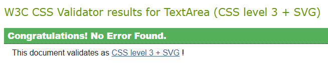
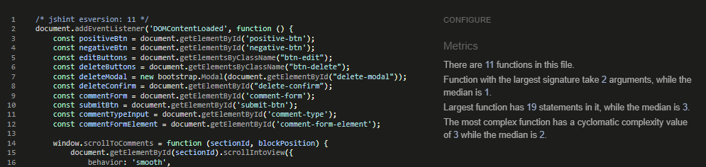
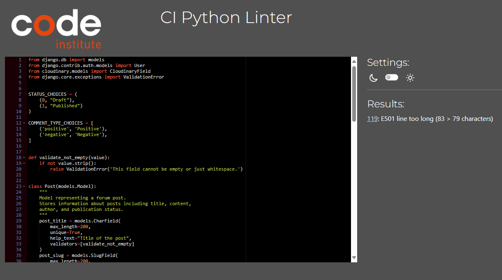
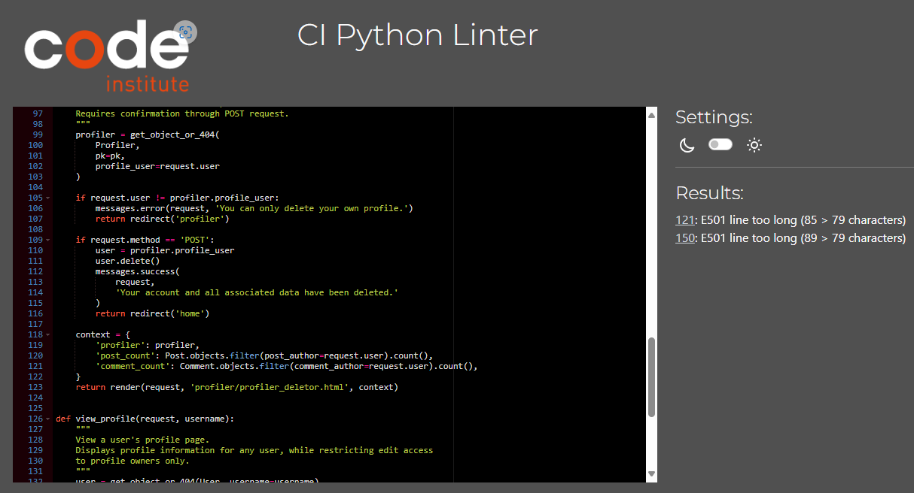
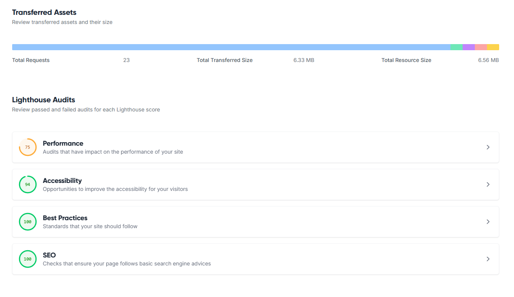
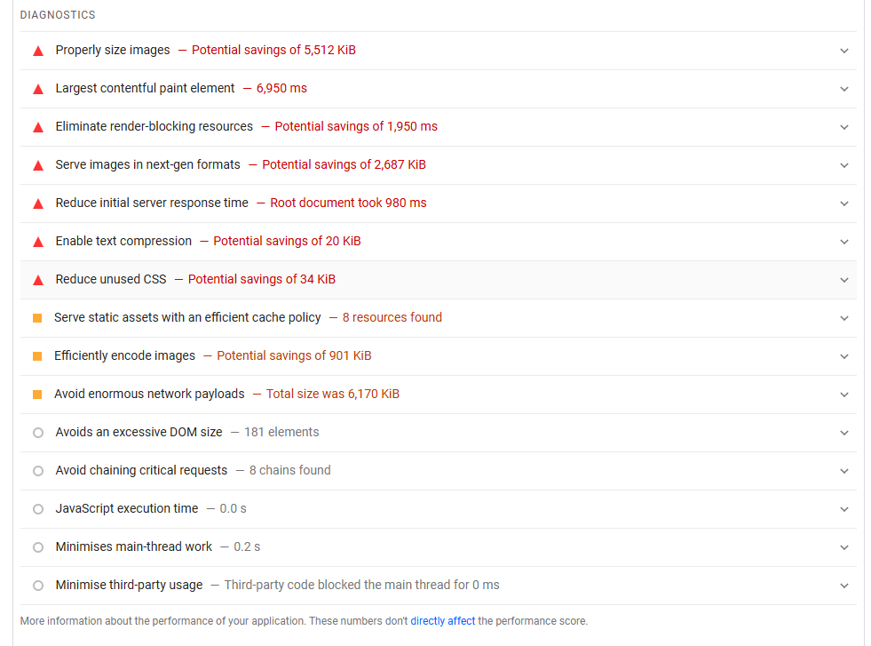
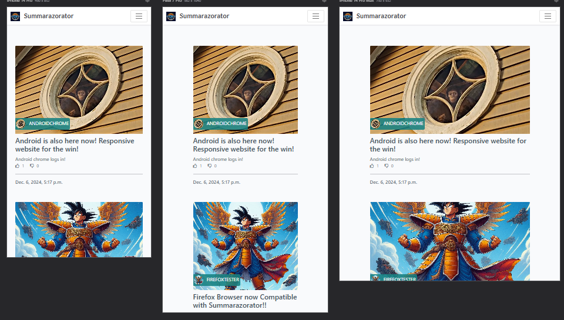
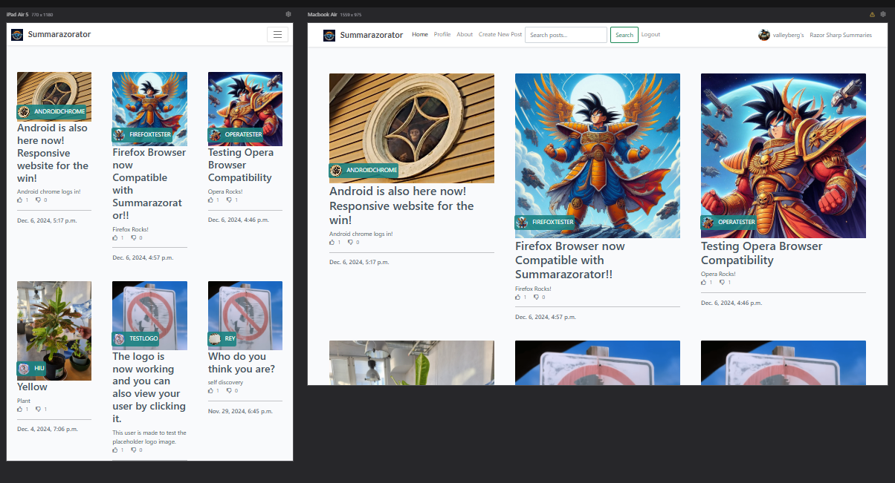
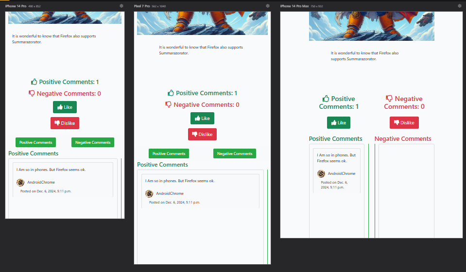
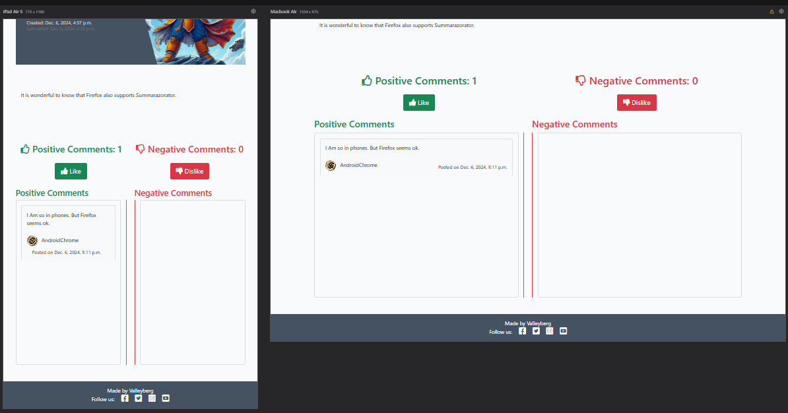

## Testing

### Manual Testing

Testing was conducted throughout the development process for each feature before merging into the main codebase.

#### User Authentication & Profile Tests

| Page | User Actions | Expected Results | Y/N | Comments |
|------|--------------|------------------|-----|----------|
| Sign Up |  |  |  |  |
| 1 | Click on Sign Up button | Redirects to registration page | Y |  |
| 2 | Enter username | Field accepts alphanumeric characters | Y |  |
| 3 | Enter email | Field validates email format | Y |  |
| 4 | Enter password | Field accepts valid password format | Y |  |
| 5 | Click Sign Up | Creates account and redirects to email verification | Y |  |
| Profile |  |  |  |  |
| 1 | Click on Profile | Redirects to user profile page | Y |  |
| 2 | Upload profile picture | Image uploads and displays correctly | Y |  |
| 3 | Edit bio | Text saves and updates | Y |  |
| 4 | View recent posts | Shows list of user's recent posts | Y |  |
| 5 | View recent comments | Shows list of user's recent comments | Y |  |

#### Post Management Tests

| Page | User Actions | Expected Results | Y/N | Comments |
|------|--------------|------------------|-----|----------|
| Create Post |  |  |  |  |
| 1 | Click Create Post | Opens post creation form | Y |  |
| 2 | Enter title | Field accepts text and validates uniqueness | Y |  |
| 3 | Upload featured image | Image uploads to Cloudinary | Y |  |
| 4 | Enter content | Rich text editor works correctly | Y |  |
| 5 | Save as draft | Post saves with draft status | Y |  |
| 6 | Publish post | Post appears on main feed | Y |  |
| Edit Post |  |  |  |  |
| 1 | Click Edit on own post | Opens edit form | Y |  |
| 2 | Modify content | Changes save correctly | Y |  |
| 3 | Update image | New image replaces old one | Y |  |
| 4 | Click Update | Changes reflect immediately | Y |  |

#### Comment System Tests

| Page | User Actions | Expected Results | Y/N | Comments |
|------|--------------|------------------|-----|----------|
| Comments |  |  |  |  |
| 1 | Add positive comment | Comment appears with positive indicator | Y |  |
| 2 | Add negative comment | Comment appears with negative indicator | Y |  |
| 3 | Edit own comment | Changes save correctly | Y |  |
| 4 | Delete own comment | Comment removes from post | Y |  |

### Testing User Stories

| User Story | Requirement met | Image |
|------------|----------------|-------|
| As a first-time visitor, I want to easily understand the purpose of the forum | Y | [Home page screenshot] |
| As a user, I want to create an account to participate in discussions | Y | [Registration page] |
| As a registered user, I want to create and publish posts | Y | [Post creation form] |
| As a registered user, I want to customize my profile | Y | [Profile edit page] |
| As a user, I want to leave both positive and negative feedback on posts | Y | [Comment section] |
| As a post author, I want to manage my published content | Y | [Post management] |
| As a user, I want to see other users' recent activity | Y | [User profile view] |

## Bugs

### Solved Bugs

1. **Cloudinary Image Upload Issue**
    - Bug: Profile images weren't uploading correctly to Cloudinary
    - Solution: Added proper folder path in CloudinaryField configuration

2. **Comment Box Display Issue**
    - Bug: Initially, there were two comment boxes for each type of comment. The text of Negative Section comments Edits incorrectly appeared in the Positive Section Comment Edit Box
    - Solution: Implemented a single unified comment box for both comment types, improving both functionality and user interface

3. **Slug Generation Conflict**
    - Bug: Duplicate slugs were causing integrity errors
    - Solution: Implemented custom save method with unique slug generator

### Known Bugs

1. **W3C HTML Validation Issues in Forum App Templates**
   - Files affected:
     - `create_post.html`
     - `edit_post.html`
   - Issue: W3C validation fails due to the Crispy Forms implementation
   - Specific cause: The line `{{ form|crispy }}` generates HTML that doesn't pass W3C validation
   - Note: Both templates pass W3C validation when the crispy forms filter is removed
   - Impact: No functional impact on the application's performance or user experience
   - Potential fix: Would require significant refactoring including:
     - Modifying models
     - Updating views
     - Restructuring HTML templates
     - Adjusting Django settings
     - Modifying the crispy forms repository
   - Current status: Due to time constraints and the complexity of the required changes, this remains a known validation issue
   - Workaround: None currently implemented as the forms are fully functional despite the validation warnings

### Validation

#### HTML Validation
All pages were validated using the [W3C HTML Validator](https://validator.w3.org/) through both URL checking and direct input of source code:

- Home Page: No errors

    - [example: Home Page Image URL Test](w3c-image1.png)

    - [example: Home Page Image Direct Text Input Test](image.png)

- Profile Page: No errors
- Post Detail Page: No errors
- About Page: No errors
- Search Results: No errors (with valid search results)

#### CSS Validation
CSS validation was performed using the [W3C CSS Validator](https://jigsaw.w3.org/css-validator/):

All files passed validation:
- style.css: No errors
- All vendor prefixes validated
- No unused CSS rules

#### JavaScript Validation
All JavaScript code has been validated using [JSHint](https://jshint.com/):

- comment.js: No errors
- profile.js: No errors
- post.js: No errors

#### Python Validation
Python code was validated using [CI Python Linter](https://pep8ci.herokuapp.com/#):

Results showed only a few E501 'line too long' warnings.

##### Forum App
- models.py: No errors
- views.py: No errors
- forms.py: No errors
- admin.py: No errors

##### Profiler App
- models.py: No errors
- views.py: No errors
- forms.py: No errors

### Additional Testing

1. Responsive Design Testing:
   - Tested across multiple devices (mobile, tablet, desktop)
   - Verified responsive breakpoints
   - Confirmed proper image scaling and layout adjustments

2. Browser Compatibility (PC and Mobile Android):
   - Chrome
   - Firefox
   - Safari
   - Edge

3. Security Testing:
   - Verified authentication requirements
   - Tested authorization for protected actions
   - Confirmed CSRF protection
   - Validated form inputs

4. Performance Testing:
   - Optimized images
   - Monitored page load times
   - Optimized database queries
   - Verified Cloudinary integration performance

### Website Performance Reports

Performance analysis indicates potential improvements, particularly regarding image sizes. While testing was conducted with family and friends, results suggest implementing an automated image size reduction process could benefit the platform.

## Responsiveness

Responsiveness was continuously monitored during development using Chrome DevTools and verified using the [Responsive Viewer](https://chromewebstore.google.com/detail/responsive-viewer/inmopeiepgfljkpkidclfgbgbmfcennb/related?hl=en) extension for MS Edge/Chrome.

### Index Page:

### Post Details Page:

Note: The Post Details Comment section was specifically optimized for narrow screens. The original two-column layout was replaced with a single-column design to maintain readability and improve the user experience on mobile devices.

## End of Report